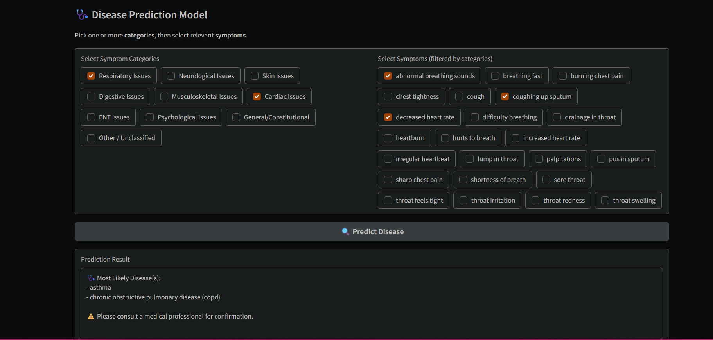

# 🩺 Disease Predictor Web App

A machine learning web app that predicts diseases based on selected symptoms.  
Built with a **hybrid stacking model** for accuracy, **Gradio** for UI, and deployed on **Hugging Face Spaces**.  

⚠️ This project is for **educational purposes only**. It is *not* a substitute for professional medical advice.

---

## 🔗 Live Demo  
👉 Try it here: [Hugging Face Space](https://huggingface.co/spaces/pk0781/disease-predictor-ml-model)

---

## 💻 Source Code  
👉 View the code and dataset here: [GitHub Repo](https://github.com/PrabhnoorKaur05/disease-predictor-webpage)

---

## 🚀 How It Works
1. Select symptom categories and specific symptoms.  
2. The app converts your selections into a machine-readable format.  
3. Three base models (**Random Forest, SVM, Logistic Regression**) make predictions.  
4. A **meta-model (Logistic Regression)** combines them for final results.  
5. The top disease(s) are displayed.  

---

## 📸 Screenshot  




---

## 🛠️ Run Locally
Clone the repo and install dependencies:
```bash
git clone https://github.com/PrabhnoorKaur05/disease-predictor-webpage.git
cd disease-predictor-webpage
pip install -r requirements.txt
python app.py
